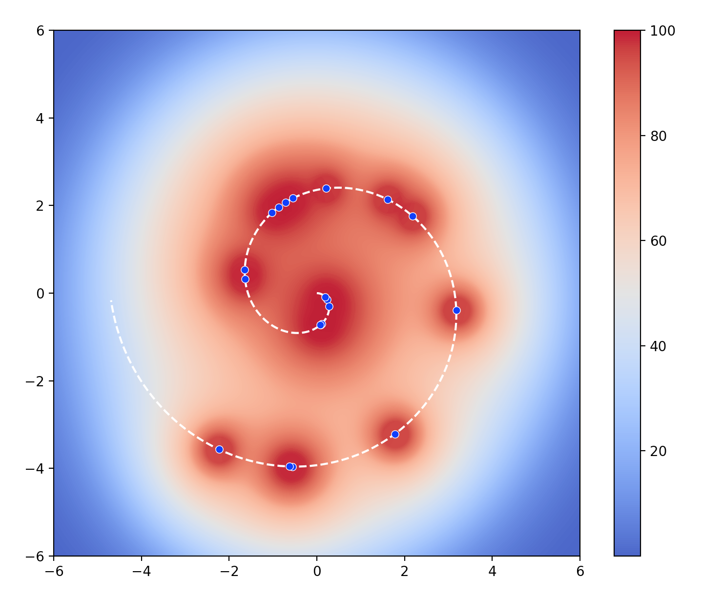

Similar to Genetic Algorithm, the Evolution Strategy is a kind of Machine learning method without using gradient descent algorithm (used in Neural Network) to find optimized solutions. Instead, it let the ‘environment’ to choose the best fit and learn from it to adapt to the environment (The idea of Evolution). 

The main goal of this demo is to apply Evolution Strategy algorithm to create points (red points) to find location of each random point (blue point) created from Archimedean Spiral curve.

The details of this demo can be accessed here: <a href = 'Evolution Strategy Algorithm and You.pdf'>Link</a>

Python package needed: 1. Numpy; 2. Matplotlib

Old version without grouping:

New algorithm with separate group and parallel computing：

The Evolution Strategy is very flexible and can be used when we can translate our problem to a ‘environment’ where good or bad can be tell. In this demo, I consider each blue point as a planet, as a result, the environment of this demo looks like this (Rescaled gravitational field in this 2-D space):

