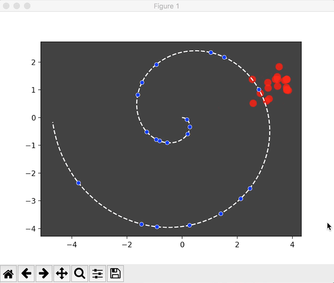
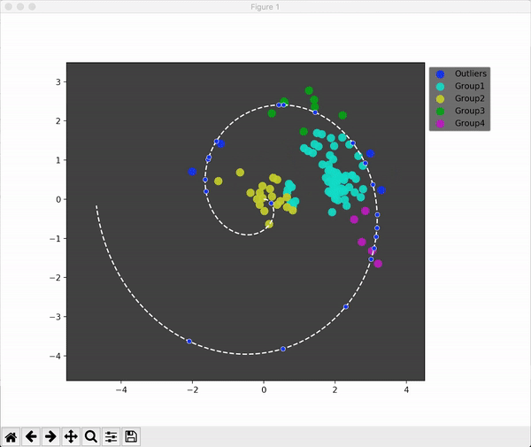

This is a small demo with using the evolution strategy to find the random points created from Archimedean Spiral curve.

The main goal of this small demo is to create points (red points) with Evolution Strategy algorithm to find location of each random point (blue point) created from Archimedean Spiral curve.

The Video of this demo can be accessed here: https://youtu.be/oSOon9Z36iY

Python package needed: 1. Numpy; 2. Matplotlib

Old version without grouping:

New algorithm with separate group and parallel computing：

