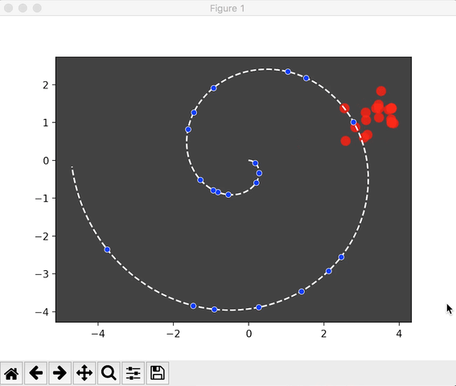
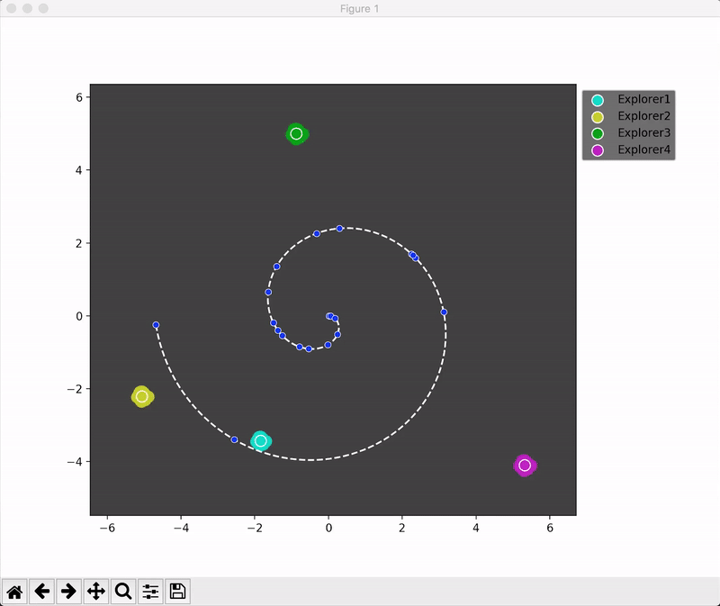

Similar to Genetic Algorithm, the Evolution Strategy is a kind of Machine learning method without using derivative and backpropagation (used in common Neural Network) to find optimized solutions. Instead, it let the ‘environment’ to choose the best fit and learn from it to adapt to the environment (The idea of Evolution). 

The main goal of this demo is to apply Evolution Strategy algorithm to create points (red points) to find location of each random point (blue point) created from Archimedean Spiral curve.

The details of this demo can be accessed here: <a href = 'Evolution Strategy Algorithm and You.pdf'>Link</a>

Python packages needed: 1. Numpy; 2. Matplotlib

Old version without grouping (version 1):

--------------------------------------------------------------------------------------------------------------------------

However, in the first version of the script, I found that many times, when the Evolution Strategy developped a 'minority groups' (A group of points which amount is relatively small), it tend to fade away though the time and can't find the blue points they are closed to. And as we all know, sometimes the truth may be held in a handful of persons' hands. To pretect them from easily disappear， I developed the second version of the script which dynamicly group them based on their distance, and consider them as a sepereate group to evolve in the future. It's kind of like the population subdivision in real life.

Algorithm with separate group and parallel computing (version 2)：

  
  

-------------------------------------------------------------------------------------------------------------------------- 

New algorithm with multiprocessing and using Evolution Strategy to estimate gradient (version 3)：

The idea of this version is from an OpenAI's <a href = 'https://arxiv.org/pdf/1703.03864.pdf'>paper</a> and <a href = 'https://blog.openai.com/evolution-strategies/'>blog</a>. Their basic idea is to use Evolution Strategy to estimate gradient in environment. I also applied multiprocessing in this version, as a rusult, different explorers are computed in different cores. 

Note: 

① You will notice in this version that even though I give different explorers different standard deviations (affect the max radius of its following points) and learning rates (affect their speed when moving in this space) they will still easily get close to each other and do repeated work. This is because this 2-D space is relatively small and also different explorers can't communicate with each other to separate works. I will try to improve this in later versions.

② Adaptive standard deviation and learning rate will also be considered in following versions. (explorers with too small standard deviation and learning rate will move very slow while explorers with too big standard deviation and learning rate will shake among several blue planets)

The Evolution Strategy is very flexible and can be used when we can translate our problem to a ‘environment’ where good or bad can be tell. In this demo, I consider each blue point as a planet, as a result, the environment of this demo looks like this (Rescaled gravitational field in this 2-D space):

